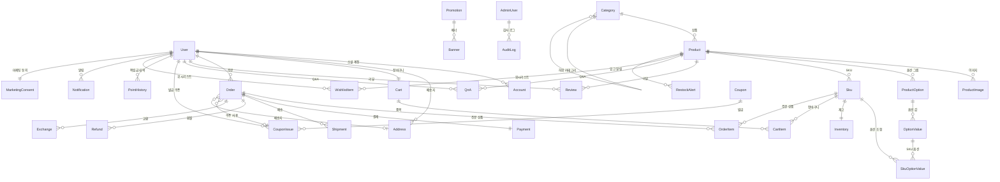

# Parable Mall - ERD (Entity Relationship Diagram)

## 전체 엔티티 관계

## 엔티티 목록 (30개)

| 영역         | 엔티티              | 설명                                        |
| ------------ | ------------------- | ------------------------------------------- |
| **회원**     | User                | 고객 정보 (등급, 누적 구매액 포함)          |
|              | Account             | 소셜 로그인 계정 (카카오/네이버/구글/Apple) |
|              | Session             | 세션 관리                                   |
|              | VerificationToken   | 이메일 인증 토큰                            |
|              | Address             | 배송지 주소록                               |
|              | MarketingConsent    | 마케팅 수신 동의 (이메일/SMS/푸시)          |
| **운영자**   | AdminUser           | 관리자 계정 (Owner/Manager/CS)              |
|              | AuditLog            | 관리자 작업 감사 로그                       |
| **카탈로그** | Category            | 상품 카테고리 (트리 구조)                   |
|              | Product             | 상품 기본 정보                              |
|              | ProductImage        | 상품 이미지                                 |
|              | ProductOption       | 옵션 그룹 (사이즈, 색상 등)                 |
|              | OptionValue         | 옵션 값 (M, L, 블랙 등)                     |
|              | Sku                 | 옵션 조합별 재고 단위                       |
|              | SkuOptionValue      | SKU-옵션값 매핑                             |
|              | Inventory           | SKU별 재고 (수량, 예약)                     |
|              | RestockAlert        | 입고 알림 신청                              |
|              | WishlistItem        | 위시리스트                                  |
| **장바구니** | Cart                | 회원 장바구니                               |
|              | CartItem            | 장바구니 품목                               |
| **주문**     | Order               | 주문 (배송지 스냅샷 포함)                   |
|              | OrderItem           | 주문 상품 (가격 스냅샷 포함)                |
|              | Payment             | 결제 정보 (토스/카카오/네이버페이)          |
|              | Shipment            | 배송 정보 (송장, 추적)                      |
|              | Refund              | 환불                                        |
|              | Exchange            | 교환                                        |
| **리뷰/Q&A** | Review, ReviewImage | 구매 리뷰 (별점, 포토)                      |
|              | QnA                 | 상품 Q&A                                    |
| **마케팅**   | Coupon              | 쿠폰 정의                                   |
|              | CouponIssue         | 쿠폰 발급/사용 내역                         |
|              | Promotion           | 프로모션/타임세일                           |
|              | Banner              | 배너                                        |
| **적립금**   | PointHistory        | 적립/사용/만료 내역                         |
| **알림**     | Notification        | 알림 메시지                                 |
